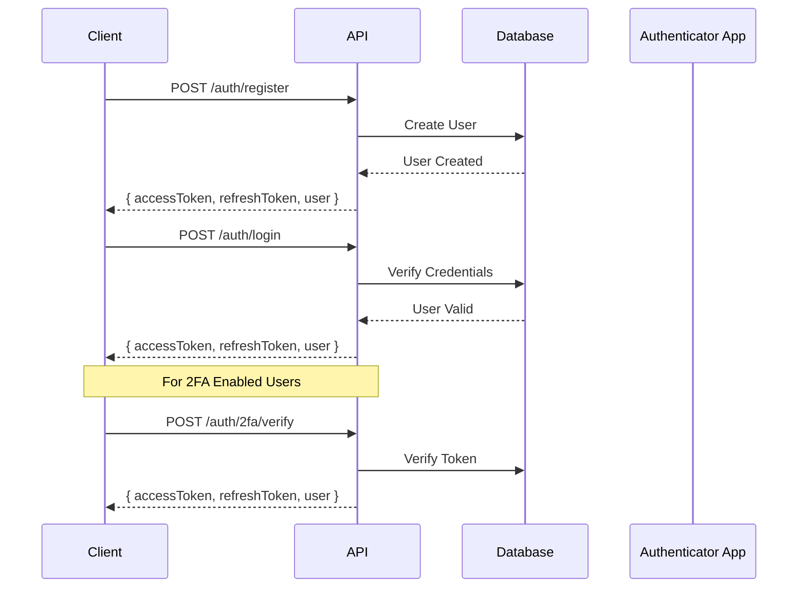
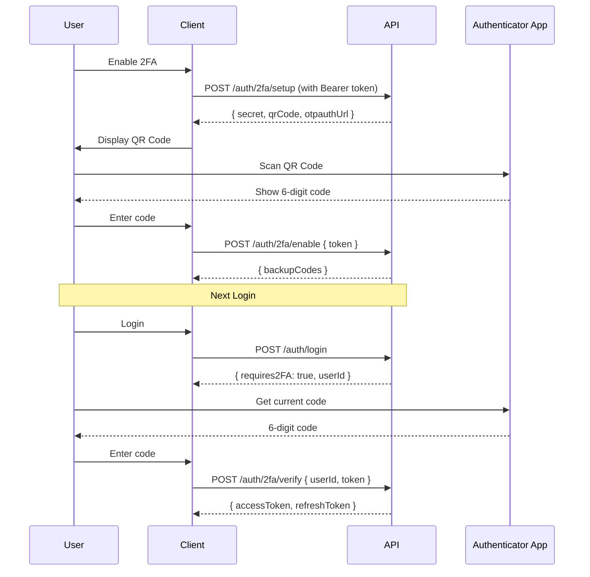
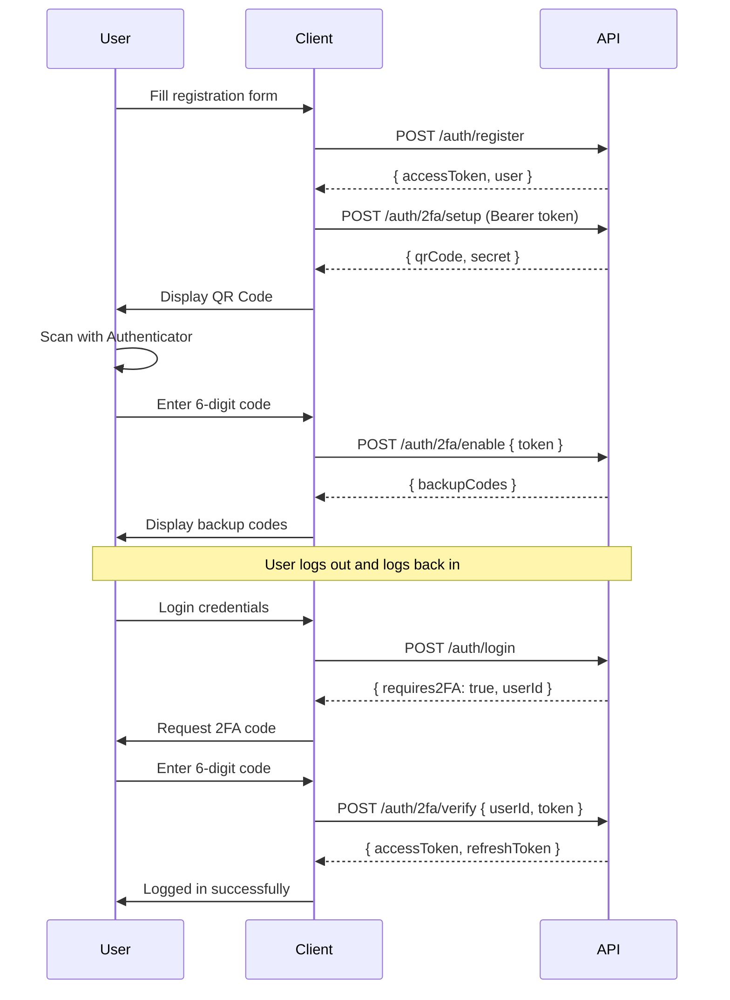
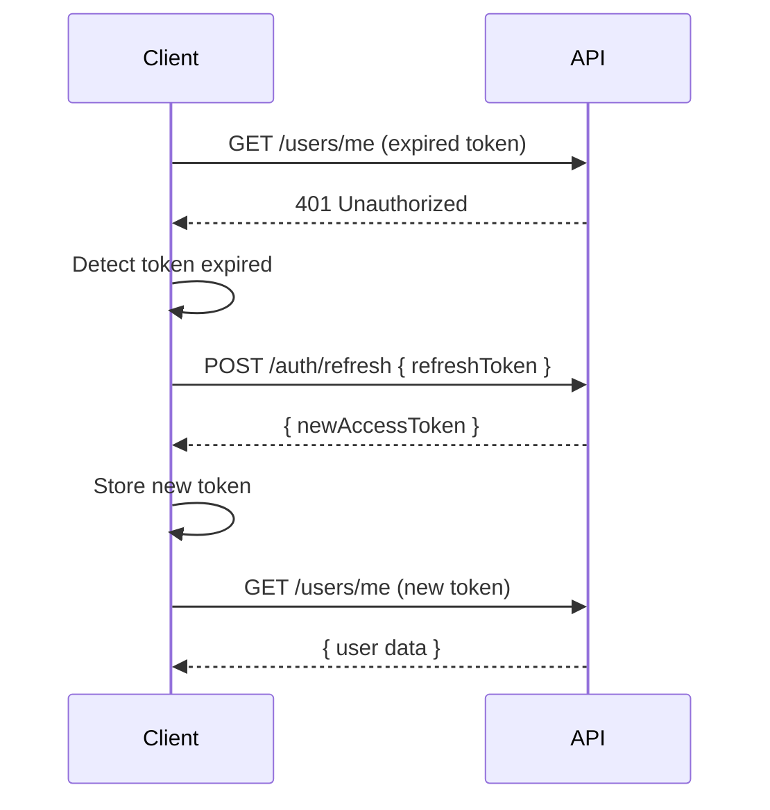

# Nexus UI Backend - Complete API Walkthrough

## Table of Contents
1. [Getting Started](#getting-started)
2. [Authentication Flow](#authentication-flow)
3. [User Registration](#user-registration)
4. [User Login](#user-login)
5. [Two-Factor Authentication (2FA)](#two-factor-authentication-2fa)
6. [Protected Routes](#protected-routes)
7. [User Management](#user-management)
8. [Session Management](#session-management)
9. [Password Management](#password-management)
10. [Security & Audit](#security--audit)

---

## Getting Started

### Base URL
```
http://localhost:5000/api/v1
```

### API Documentation
Interactive Swagger UI is available at:
```
http://localhost:5000/api/v1/docs
```

### Authentication
Most endpoints require Bearer token authentication. Include the token in the Authorization header:
```
Authorization: Bearer <your_access_token>
```

---

## Authentication Flow

### Complete Authentication Sequence



---

## User Registration

### Step 1: Register a New User

**Endpoint:** `POST /auth/register`

**Request:**
```json
{
  "email": "user@example.com",
  "username": "johndoe",
  "password": "SecurePass@123",
  "firstName": "John",
  "lastName": "Doe"
}
```

**Response (201):**
```json
{
  "success": true,
  "message": "User registered successfully",
  "data": {
    "user": {
      "_id": "507f1f77bcf86cd799439011",
      "email": "user@example.com",
      "username": "johndoe",
      "firstName": "John",
      "lastName": "Doe",
      "role": "user",
      "isActive": true,
      "isEmailVerified": false,
      "twoFactorEnabled": false
    },
    "accessToken": "eyJhbGciOiJIUzI1NiIsInR5cCI6IkpXVCJ9...",
    "refreshToken": "eyJhbGciOiJIUzI1NiIsInR5cCI6IkpXVCJ9...",
    "expiresIn": "15m"
  }
}
```

**Password Requirements:**
- Minimum 8 characters
- At least one uppercase letter
- At least one lowercase letter
- At least one number
- At least one special character

---

## User Login

### Step 2: Login

**Endpoint:** `POST /auth/login`

**Request:**
```json
{
  "emailOrUsername": "user@example.com",
  "password": "SecurePass@123"
}
```

**Response (200) - Without 2FA:**
```json
{
  "success": true,
  "message": "Login successful",
  "data": {
    "user": { /* user object */ },
    "accessToken": "eyJhbGciOiJIUzI1NiIsInR5cCI6IkpXVCJ9...",
    "refreshToken": "eyJhbGciOiJIUzI1NiIsInR5cCI6IkpXVCJ9...",
    "expiresIn": "15m",
    "requires2FA": false
  }
}
```

**Response (200) - With 2FA Enabled:**
```json
{
  "success": true,
  "message": "2FA verification required",
  "data": {
    "userId": "507f1f77bcf86cd799439011",
    "requires2FA": true
  }
}
```

---

## Two-Factor Authentication (2FA)

### 2FA Flow Diagram



### Step 3: Setup 2FA

**Endpoint:** `POST /auth/2fa/setup`

**Headers:**
```
Authorization: Bearer <access_token>
```

**Response (200):**
```json
{
  "success": true,
  "data": {
    "secret": "LZUU6JLWMFIUERBPHBXTGW2UJNJTUM2U",
    "qrCode": "data:image/png;base64,iVBORw0KGgoAAAA...",
    "otpauthUrl": "otpauth://totp/NexusUI:user@example.com?secret=LZUU6..."
  }
}
```

**How to use the QR code:**
1. Copy the `qrCode` value (entire data URL)
2. Display it in an `` tag or paste directly in browser
3. Scan with Google Authenticator, Authy, or Microsoft Authenticator

### Step 4: Enable 2FA

**Endpoint:** `POST /auth/2fa/enable`

**Headers:**
```
Authorization: Bearer <access_token>
```

**Request:**
```json
{
  "token": "123456"
}
```

**Response (200):**
```json
{
  "success": true,
  "message": "Two-factor authentication enabled successfully",
  "data": {
    "backupCodes": [
      "ABCD-1234-EFGH-5678",
      "IJKL-9012-MNOP-3456",
      "QRST-7890-UVWX-1234"
    ]
  }
}
```

**⚠️ Important:** Save backup codes securely. They can be used to access your account if you lose your authenticator device.

### Step 5: Verify 2FA During Login

**Endpoint:** `POST /auth/2fa/verify`

**Request:**
```json
{
  "userId": "507f1f77bcf86cd799439011",
  "token": "123456"
}
```

**Response (200):**
```json
{
  "success": true,
  "data": {
    "user": { /* user object */ },
    "accessToken": "eyJhbGciOiJIUzI1NiIsInR5cCI6IkpXVCJ9...",
    "refreshToken": "eyJhbGciOiJIUzI1NiIsInR5cCI6IkpXVCJ9...",
    "expiresIn": "15m"
  }
}
```

### Check 2FA Status

**Endpoint:** `GET /auth/2fa/status`

**Headers:**
```
Authorization: Bearer <access_token>
```

**Response (200):**
```json
{
  "success": true,
  "data": {
    "enabled": true,
    "method": "totp"
  }
}
```

### Disable 2FA

**Endpoint:** `POST /auth/2fa/disable`

**Headers:**
```
Authorization: Bearer <access_token>
```

**Request:**
```json
{
  "token": "123456"
}
```

**Response (200):**
```json
{
  "success": true,
  "message": "Two-factor authentication disabled successfully"
}
```

---

## Protected Routes

### Get Current User Profile

**Endpoint:** `GET /auth/me`

**Headers:**
```
Authorization: Bearer <access_token>
```

**Response (200):**
```json
{
  "success": true,
  "data": {
    "user": {
      "_id": "507f1f77bcf86cd799439011",
      "email": "user@example.com",
      "username": "johndoe",
      "firstName": "John",
      "lastName": "Doe",
      "role": "user",
      "isActive": true,
      "isEmailVerified": false,
      "twoFactorEnabled": true,
      "lastLogin": "2024-01-15T10:30:00.000Z",
      "createdAt": "2024-01-01T08:00:00.000Z"
    }
  }
}
```

---

## User Management

### Get All Users (Admin Only)

**Endpoint:** `GET /users`

**Headers:**
```
Authorization: Bearer <admin_access_token>
```

**Query Parameters:**
- `page` (number): Page number (default: 1)
- `limit` (number): Items per page (default: 10)
- `sort` (string): Sort field
- `order` (string): asc or desc

**Response (200):**
```json
{
  "success": true,
  "data": {
    "users": [ /* array of users */ ],
    "pagination": {
      "total": 100,
      "page": 1,
      "limit": 10,
      "totalPages": 10
    }
  }
}
```

### Get User by ID

**Endpoint:** `GET /users/:userId`

**Headers:**
```
Authorization: Bearer <access_token>
```

**Response (200):**
```json
{
  "success": true,
  "data": {
    "user": { /* user object */ }
  }
}
```

### Update User Profile

**Endpoint:** `PATCH /users/me`

**Headers:**
```
Authorization: Bearer <access_token>
```

**Request:**
```json
{
  "firstName": "John",
  "lastName": "Smith",
  "email": "newemail@example.com"
}
```

**Response (200):**
```json
{
  "success": true,
  "message": "Profile updated successfully",
  "data": {
    "user": { /* updated user object */ }
  }
}
```

### Update User Role (Admin Only)

**Endpoint:** `PATCH /users/:userId/role`

**Headers:**
```
Authorization: Bearer <admin_access_token>
```

**Request:**
```json
{
  "role": "moderator"
}
```

**Available Roles:**
- `guest`
- `user`
- `moderator`
- `admin`

**Response (200):**
```json
{
  "success": true,
  "message": "User role updated successfully",
  "data": {
    "user": { /* updated user object */ }
  }
}
```

### Activate/Deactivate User (Admin Only)

**Endpoint:** `PATCH /users/:userId/status`

**Headers:**
```
Authorization: Bearer <admin_access_token>
```

**Request:**
```json
{
  "isActive": false
}
```

**Response (200):**
```json
{
  "success": true,
  "message": "User status updated successfully"
}
```

---

## Session Management

### Get Active Sessions

**Endpoint:** `GET /auth/sessions`

**Headers:**
```
Authorization: Bearer <access_token>
```

**Response (200):**
```json
{
  "success": true,
  "data": {
    "sessions": [
      {
        "sessionId": "session_123",
        "device": "Chrome on Windows",
        "ip": "192.168.1.100",
        "lastActive": "2024-01-15T10:30:00.000Z",
        "current": true
      }
    ]
  }
}
```

### Refresh Access Token

**Endpoint:** `POST /auth/refresh`

**Request:**
```json
{
  "refreshToken": "eyJhbGciOiJIUzI1NiIsInR5cCI6IkpXVCJ9..."
}
```

**Response (200):**
```json
{
  "success": true,
  "data": {
    "accessToken": "eyJhbGciOiJIUzI1NiIsInR5cCI6IkpXVCJ9...",
    "expiresIn": "15m"
  }
}
```

### Rotate Refresh Token (More Secure)

**Endpoint:** `POST /auth/rotate`

**Request:**
```json
{
  "refreshToken": "eyJhbGciOiJIUzI1NiIsInR5cCI6IkpXVCJ9..."
}
```

**Response (200):**
```json
{
  "success": true,
  "data": {
    "accessToken": "eyJhbGciOiJIUzI1NiIsInR5cCI6IkpXVCJ9...",
    "refreshToken": "eyJhbGciOiJIUzI1NiIsInR5cCI6IkpXVCJ9...",
    "expiresIn": "15m"
  }
}
```

### Logout

**Endpoint:** `POST /auth/logout`

**Request:**
```json
{
  "refreshToken": "eyJhbGciOiJIUzI1NiIsInR5cCI6IkpXVCJ9..."
}
```

**Response (200):**
```json
{
  "success": true,
  "message": "Logged out successfully"
}
```

### Logout from All Devices

**Endpoint:** `POST /auth/logout-all`

**Headers:**
```
Authorization: Bearer <access_token>
```

**Response (200):**
```json
{
  "success": true,
  "message": "Logged out from all devices successfully"
}
```

---

## Password Management

### Change Password (Authenticated)

**Endpoint:** `POST /auth/change-password`

**Headers:**
```
Authorization: Bearer <access_token>
```

**Request:**
```json
{
  "currentPassword": "OldPass@123",
  "newPassword": "NewSecurePass@456"
}
```

**Response (200):**
```json
{
  "success": true,
  "message": "Password changed successfully"
}
```

### Forgot Password

**Endpoint:** `POST /auth/forgot-password`

**Request:**
```json
{
  "email": "user@example.com"
}
```

**Response (200):**
```json
{
  "success": true,
  "message": "Password reset email sent successfully"
}
```

### Reset Password

**Endpoint:** `POST /auth/reset-password`

**Request:**
```json
{
  "token": "reset_token_from_email",
  "newPassword": "NewSecurePass@456"
}
```

**Response (200):**
```json
{
  "success": true,
  "message": "Password reset successfully"
}
```

---

## Security & Audit

### Get Audit Logs (Admin Only)

**Endpoint:** `GET /audit`

**Headers:**
```
Authorization: Bearer <admin_access_token>
```

**Query Parameters:**
- `page` (number): Page number
- `limit` (number): Items per page
- `userId` (string): Filter by user ID
- `action` (string): Filter by action type
- `startDate` (date): Start date filter
- `endDate` (date): End date filter

**Response (200):**
```json
{
  "success": true,
  "data": {
    "logs": [
      {
        "userId": "507f1f77bcf86cd799439011",
        "action": "LOGIN",
        "resource": "auth",
        "ip": "192.168.1.100",
        "userAgent": "Chrome/120.0",
        "timestamp": "2024-01-15T10:30:00.000Z",
        "status": "success"
      }
    ],
    "pagination": { /* pagination info */ }
  }
}
```

### Get Security Events

**Endpoint:** `GET /security/events`

**Headers:**
```
Authorization: Bearer <admin_access_token>
```

**Response (200):**
```json
{
  "success": true,
  "data": {
    "events": [
      {
        "type": "FAILED_LOGIN",
        "userId": "507f1f77bcf86cd799439011",
        "ip": "192.168.1.100",
        "timestamp": "2024-01-15T10:30:00.000Z",
        "severity": "warning"
      }
    ]
  }
}
```

---

## API Sequence Examples

### Complete Registration to 2FA Flow



### Token Refresh Flow



---

## Rate Limiting

The API implements rate limiting to prevent abuse:

- **General endpoints:** 100 requests per 15 minutes
- **Auth endpoints:** 20 requests per 15 minutes
- **Registration:** 3 registrations per hour per IP

**Rate limit exceeded response (429):**
```json
{
  "success": false,
  "message": "Too many requests, please try again later"
}
```

---

## Error Responses

### Common Error Codes

| Status Code | Description |
|------------|-------------|
| 400 | Bad Request - Validation failed |
| 401 | Unauthorized - Invalid/missing token |
| 403 | Forbidden - Insufficient permissions |
| 404 | Not Found - Resource doesn't exist |
| 423 | Locked - Account is locked |
| 429 | Too Many Requests - Rate limit exceeded |
| 500 | Internal Server Error |

### Error Response Format

```json
{
  "success": false,
  "message": "Error message here",
  "statusCode": 400,
  "errors": [ /* validation errors if applicable */ ]
}
```

---

## Best Practices

### 1. Token Storage
- **Access Token:** Store in memory (React state/Redux)
- **Refresh Token:** Store in httpOnly cookie or secure storage
- Never store tokens in localStorage for production

### 2. Token Refresh Strategy
```javascript
// Pseudo code for token refresh
async function apiCall(endpoint, options) {
  let response = await fetch(endpoint, {
    ...options,
    headers: {
      'Authorization': `Bearer ${accessToken}`
    }
  });

  if (response.status === 401) {
    // Token expired, refresh it
    const refreshResponse = await fetch('/auth/refresh', {
      method: 'POST',
      body: JSON.stringify({ refreshToken })
    });

    const { accessToken: newToken } = await refreshResponse.json();

    // Retry original request
    response = await fetch(endpoint, {
      ...options,
      headers: {
        'Authorization': `Bearer ${newToken}`
      }
    });
  }

  return response;
}
```

### 3. Security Headers
All responses include security headers:
- `X-Content-Type-Options: nosniff`
- `X-Frame-Options: DENY`
- `Strict-Transport-Security`
- `Content-Security-Policy`

### 4. CORS Configuration
Allowed origins are configured in environment variables. For development:
```env
CORS_ORIGIN=http://localhost:3000,http://localhost:5000
CORS_CREDENTIALS=true
```

---

## Testing with Swagger UI

1. Navigate to `http://localhost:5000/api/v1/docs`
2. Click "Authorize" button
3. Enter your Bearer token
4. All authenticated endpoints will include the token automatically

---

## Postman Collection

Import this collection structure:

```json
{
  "info": {
    "name": "Nexus UI Backend API",
    "schema": "https://schema.getpostman.com/json/collection/v2.1.0/collection.json"
  },
  "auth": {
    "type": "bearer",
    "bearer": [
      {
        "key": "token",
        "value": "{{accessToken}}",
        "type": "string"
      }
    ]
  },
  "variable": [
    {
      "key": "baseUrl",
      "value": "http://localhost:5000/api/v1"
    },
    {
      "key": "accessToken",
      "value": ""
    }
  ]
}
```

---

## Support

For issues or questions:
- **Documentation:** http://localhost:5000/api/v1/docs
- **Health Check:** http://localhost:5000/health
- **GitHub Issues:** [Create an issue](https://github.com/your-repo/issues)

---

**Last Updated:** 2024-01-15
**API Version:** 1.0.0
